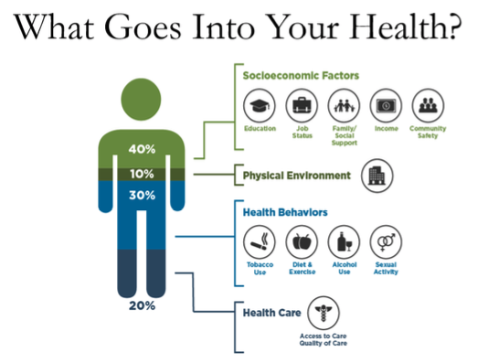

[Previous Page](toc.html)

The influence of social determinants on health outcomes is increasingly recognized in emerging payment reform programs, federal and state-based policies, and information technology initiatives.  Social determinants of health (SDOH) are defined by the World Health Organization as the conditions in which people are born, live, work, and age.  

The growing awareness around SDOH has contributed to efforts to address actionable socioeconomic risk factors through the health care delivery system.  Recommendations from national groups, including the American Academy of Pediatrics, American Academy of Family Physicians, Agency for Healthcare Research and Quality, National Quality Forum (NQF), and Institute for Health Care Improvement underscore the various roles the health care system could play in helping to identify and reduce patients social risk factors. 

<table><tr><td></td></tr></table>
*Source: Institute for Clinical Systems Improvement, Going Beyond Clinical Walls: Solving Complex Problems (October 2014) Adapted from The Bridgespan Group*

These national calls to action for health care systems have spurred innovations, including a wide range of social risk screening tools and practice-based interventions.   Some of these innovations have helped to reduce social risks, improve health outcomes, and lower costs.   The experimentation in this area has been bolstered by new value-based payment models and accountable care organizations (ACOs), which together offer financial incentives to advance coordinated care between medical and social service organizations and other organizations directly connected to patients. 

Many of the recent innovations in this area begin with the strategic collection of SDOH data.  As examples, the Centers for Medicare & Medicaid Services Innovation Center (CMS Innovation Center) Comprehensive Primary Care Plus Model requires providers to assess patients social risks, and the CMS Innovation Centers Accountable Health Communities Model developed a social risk assessment tool to help identify and address social risks across clinical and community-based settings. 

These emerging initiatives to collect SDOH data in health care settings present new challenges for national goals to standardize patient data recorded in electronic health records (EHRs).   Two Health Information Technology for Economic and Clinical Health Act (HITECH) Programs require providers to use health IT systems that capture specific patient data in standardized formats to enable interoperable data exchange with other systems. 

These programs require that EHRs use a common clinical data set (CCDS), including specific medical codes, to represent concepts such as race, ethnicity, and preferred language, but they include limited requirements to represent social risk assessments and related social care interventions.  As an example, though the Office of the National Coordinator (ONC) 2015 Edition includes an optional certification criterion around Social, Psychological, and Behavioral Data, which helps to define codes for SDOH concepts based on the National Academy of Sciences, Engineering, and Medicine Recommended Social and Behavioral Domains and Measures, it does not reflect the wide range of social risk factors being collected in clinical settings. 

The capture and exchange of interoperable data allows providers to share specific information with health plan payers who seek to aggregate and analyze population health  data for the purpose of stratifying risk, enabling data-driven financial models for value-based payment, addressing the opioid epidemic, supporting prevention and control of chronic disease, encouraging community-based care coordination, and other activities that are proving to substantially reduce overall health care expenditures.  Population health data can include patient demographics, patient access points, service delivery histories, outcome breakdowns and referrals.  The collection of this data can help inform payer organizations policies, investment strategies, and community engagement in addition to helping them better understand and address social needs within the community.

Many payers have recently focused on collaborating with providers and local service agencies to stand up community programs that help individuals more easily navigate complex health care systems, provide more revenue to communities from both public and private sources, and support closed-loop referrals.  Programs to address SDOH have been launched during the past few years by Kaiser Permanente, UnitedHealthcare in partnership with the American Medical Association, Anthem, Humana, University of Pittsburgh Medical Center (UPMC) Health Plan, CareSource, Health Net, Harvard, Pilgrim, Blue Cross Blue Shield, WellCare Health Plans, and others. 

 

## Gravity Project Overview

In light of growing interest in capturing SDOH data in health care settings and concerns about the capacity of existing medical terminology standards to effectively capture the necessary data, the Social Interventions Research and Evaluation Network (SIREN) convened a diverse group of stakeholders, including experts in SDOH data from health care, community health, and health information technology (health IT) in November 2017 to develop a strategy for achieving consensus-based comprehensive coding standards for SDOH data capture in EHR systems.  Participants concluded that current codes are insufficient to represent the data needed to support clinical care, panel management/quality improvement, community health improvement, payment/risk adjustment, and research.  As a next step, participants recommended convening a multi-stakeholder group through an open, public process to better articulate SDOH data use cases.  In response, SIREN, with sponsorship from the Robert Wood Johnson Foundation, initiated the Gravity Project:  A Social Determinants of Health Coding Collaborative.

<table><tr><td></td></tr></table>

In August 2019, Health Level Seven International (HL7), the global authority for interoperability in health information technology, and the American Academy of Family Physicians (AAFP), the only medical society devoted solely to primary care, announced that the Gravity Project is now part of the HL7 FHIR Accelerator Program.

The Gravity Project aims to standardize medical codes to facilitate the use of social determinants of health-related data in patient care, care coordination between the health and human services sectors, population health management, value-based payment and clinical research. Social determinants of health (SDOH) are the conditions in which people are born, grow, work, live, and age, and the wider set of forces and systems shaping the conditions of daily life.

The HL7 FHIR Accelerator Program is designed to assist implementers across the health care spectrum to create HL7 FHIR implementation guides and other products than can facilitate FHIR acceleration and adoption activities. Other projects within the Accelerator Program include Argonaut, Da Vinci and CARIN Alliance.

 
## Gravity Project Challenge Statement

The systematic documentation and aggregation of SDOH data in EHRs and related systems is limited due to the following: 

1.	Limited understanding by the health system of the value and use of such data for clinical care and population health management; 
2.	Capture of SDOH data in unstructured and non-standardized formats, which inhibits the ability to normalize, exchange, and aggregate the data regardless of the data source; and 
3.	Gaps in and overlap between existing terminologies and codes available to represent SDOH-related activities undertaken in clinical delivery settings.

Based on the growing collection of social risk data in health care systems, an immediate opportunity exists to support data collection, data aggregation, data sharing, quality measurement, benchmarking, and risk adjustment.   Many assessment tools are currently in use, but the concepts addressed vary, and some tools merit further validation and testing across a variety of settings and clinical workflows.  Health IT can play a critical, untapped role in enabling the seamless electronic exchange and use of this data.  However, standardization and harmonization of SDOH concepts, regardless of the social risk assessment tool used, requires a consensus-based approach to maximize buy-in, consistency of implementation, and usefulness of data collected.

 
##  SDOH Domain Scope

The Gravity Project focus on defining coded content to support three priority social domains, **food insecurity**, **housing instability and quality**, and **transportation access**.
<table><tr><td></td></tr></table>

 
###  Out of SDOH Domain Scope

The Gravity Project will not focus on evaluating, testing, or harmonizing existing social risk screening tools and instruments, nor will it identify social risk data elements that do not directly support one of the three priority social domains previously listed in the Scope Statement. This project also will not validate or provide incentives for implementation of the identified SDOH data elements.

 
## Conceptual Framework

Coded SDOH content is captured across four core health care activities: screening, assessment/diagnosis, goal setting, and interventions. The conceptual framework illustrated below shows how these activities form a cycle of care. Over time, as additional screening and assessment is performed, a patients progress toward care goals can be tracked and measured.

<table><tr><td></td></tr></table>

**Screening**:  This refers to activities where SDOH data from individual patients are initially captured, whether through a self-administered, provider-administered, or health plan-administered questionnaire.  These activities may also be repeated at certain intervals to monitor changes in social risks.

**Assessment/Diagnosis**: These include activities where providers (clinical and community-based) and health plans analyze the data obtained through screening to determine a patients social risks and needs.

**Interventions**:  These refer to actions undertaken by providers (clinical and community-based) and health plans to help address identified social needs.  These include referrals, case management, care planning, counseling and education, and provision of services and orders.

**Goals**: These refer to the intention of care the why of treatment/intervention.  Goals can be both patient and population specific.  Patient goals are best made collaboratively with the patient and care team aligned with principles of person-centered care.

 
## Data Modeling Framework
The figure below was derived from the HL7 Patient Care WG Domain Analysis model for Care Plan information. It informs the design of the  FHIR Resources used in this IG.

<table><tr><td></td></tr></table>

The relationships between the various types of information are supported by the designs developed for the resources. The diagram below shows the data model for the assessment observation, condition (diagnosis), and goal (patient centered goal). The semantics designed for the profiled resources support the envisioned cycles of assessment, diagnosis, and goal setting. The mind map illustration represents profiles developed in this IG for the FHIR Observation, Condition, and Goal Resources. It shows instances of profiled Resources that would be used over time as part of an iterative care process. 

<table><tr><td></td></tr></table>

The data modeling includes additional considerations specified using FHIR Path expressions.

| Profile                                                         | Additional Constraints                                                                                                                                                                                                                                                                                                                                                                                                                                                                                                                                                        |
|------------------------------------------------|-------------------------------------------------------------------------------------------------------------------------------------------------------------------------------------------------------------------------------------------------------------------------------------------------------------------------------------------------------------------------------------------------------------------------------------------------------------------------------------------------------------------------------------------------------------------------------|
| Observation Profile 1 instance 1 | Food insecurity observation that is the result of clinical  assessment based on information collected in the screening  questionnaire and other information gathered during the  encounter.   1) Allows an Observation that specifies Food insecurity absent (aka Food Security), Mild food insecurity, Moderate food insecurity, Severe Food insecurity, or Food insecurity, unknown.   2) xpath rules could specify xpath that must either  Observation.valueCodableConcept or  Observation.dataAbsentReason, but not both, must be provided. |
| Condition                        | Allows a Condition that specifies Mild food insecurity, Moderate  food insecurity, Severe Food insecurity.                                                                                                                                                                                                                                                                                                                                                                                                                                                                |
| Goal                             | Patient-centered goal documenting the desired outcome  of planned interventions.                                                                                                                                                                                                                                                                                                                                                                                                                                                                                          |
| Observation Profile 1 instance 2 | Food insecurity observation that is the result of a post-goal,  post-intervention evaluation/assessment.                                                                                                                                                                                                                                                                                                                                                                                                                                                                  |
{:class="table table-bordered"}
{:.table-striped}

 
### Role of the FHIR CarePlan Resource
Initially, Care Plan information exchange mechanisms were developed using the HL7 Clinical Document Architecture (CDA) standard. A Care Plan Document template was defined in the HL7 Consolidated C-CDA  Implementation Guide. It comprised four sections representing the primary informational components (Health Concerns, Goals, Interventions, and Health Status Evaluations and Outcomes). The discrete entries defined to hold these different types of information included linkages that allowed the relationships between the information to be recorded. Interventions planned and performed could be linked to the goals they were intended to make progress toward and those goals could be linked to the health concerns being addressed. Observations made to evaluate progress could be associated with specific interventions, or to document progress toward accomplishing the targeted goal(s). Processing the information in four separate sections and rendering it in a useful way to show the inherent relationships across the pieces of information was challenging and adoption of the C-CDA Care Plan Document template was challenging for implementers.  Exploration of organizing information captured in a clinical encounter to expose the care plan view of the story remains a nascent activity. More progress has been made on exchanging this information in the form of an Encounter Summary organized using the individual sections of C-CDA Documents in a way that does not focus on the linkages across the pieces of information.  This more traditional SOAP Note view has seen more exploration via C-CDA Document Templates such as Discharge Summary, Progress Note, and History and Physical Note.

After the advent of FHIR, a CarePlan Resource was developed to accomplish the need to express the relationships between information about health concerns, goals, interventions, and supporting clinical observations resulting from screening, assessment, and evaluation activities. The CarePlan Resource was designed to make linkages between these care plan cornerstone components of information.

The figure below shows a larger scope of data modeling to incorporate a care plan to express and track care delivery to address a specific condition. The more complex data model brings in the screening done to inform the assessment, and the interventions planned and performed to make progress toward the goal. 

<table><tr><td></td></tr></table>

Again, the mind map shows instances of profiled Resources that would be used over time as part of an iterative care process. when the patient progresses from: Initial Observation(s) -> Initial Condition(s) - based on Initial Observation(s) -> Initial Care Plan and Initial Goal(s) - based on Initial Condition(s) ->Initial Service Request(s) and Initial Procedure(s)/Intervention(s) - based on Initial Care plan and Initial Goal(s)->Subsequent Observation(s) -> Subsequent Condition(s) -> Revised Care Plan and Revised Goal(s) -> etc. 

This data modeling aligns with the Conceptual Framework described earlier as the foundation for the use cases covered by this IG.

While the CarePlan Resource makes it easier to organize informational components according to a care planning perspective, it also is possible in FHIR to create Encounter Summary Documents that present the very same information in a more familiar SOAP Note type of view.  The FHIR Composition Resource uses sections that function in the same way (and use the same LOINC Document Ontology codes) as C-CDA.  In fact, the C-CDA on FHIR Implementation Guide provides guidance on how to implement each of the C-CDA Clinical Note types using the FHIR Composition Resource and underlying FHIR Resources like Condition, Goal, Procedure, MedicationRequest, and Observation to record the machine processable data that accompanies the human readable narrative in the sections. 

The illustration below shows wireframe representation of structured documents used to exchange clinical information summarizing a patients medical history over a span of time, summarizing a specific patient encounter, or summarized to support referral to an outside organization for additional patient care/services. 

<table><tr><td></td></tr></table>

[Next Page](SDOH_Content.html)